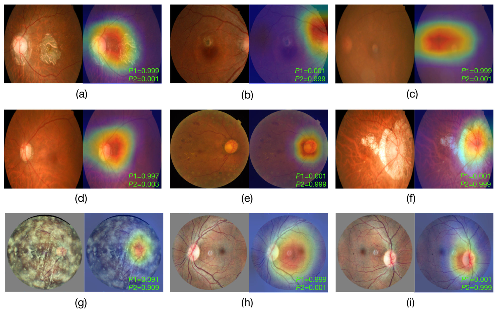

# Eye-laterality-detection
A state-of-the-art deep learning model for fundus-image based eye laterality detection

Code of the article **A Self-Adaptive Deep Learning Method for Automated Eye Laterality Detection Based on Color Fundus Photography**

